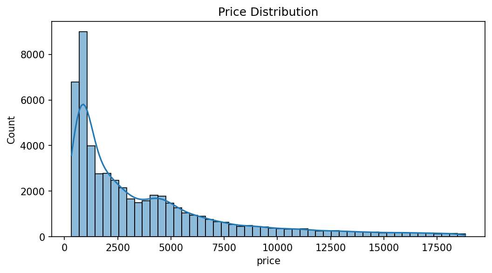
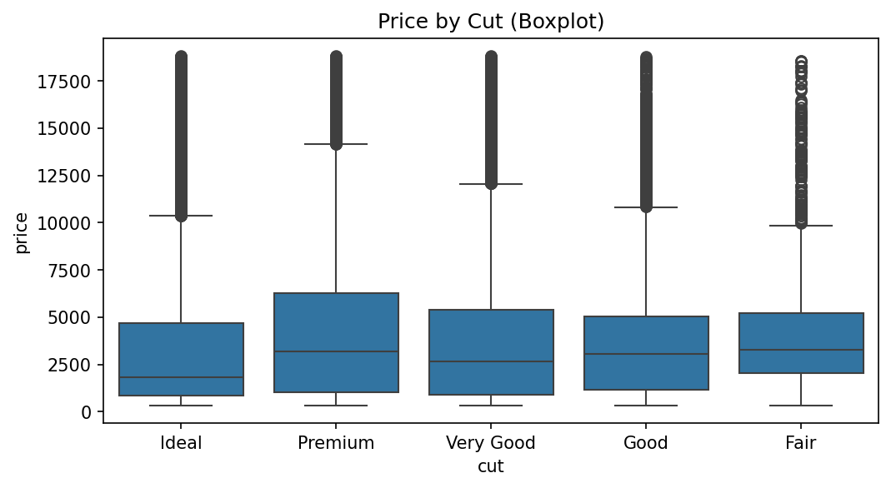
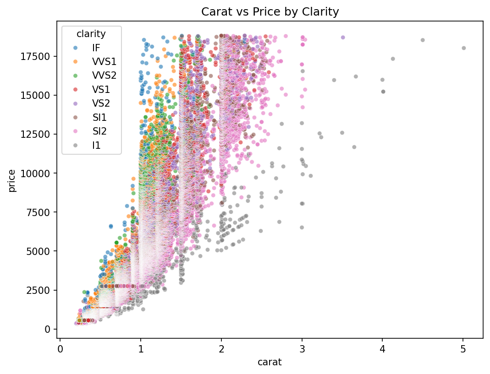
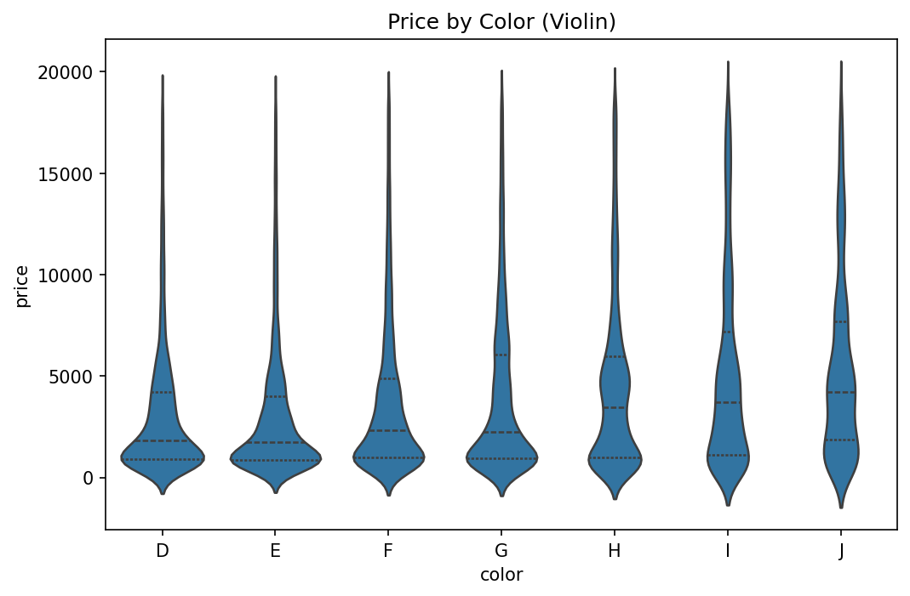
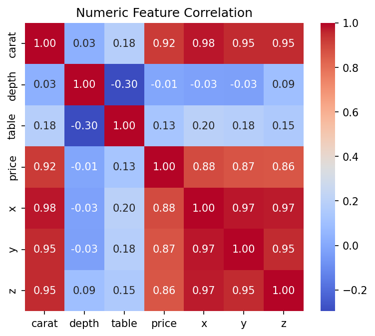
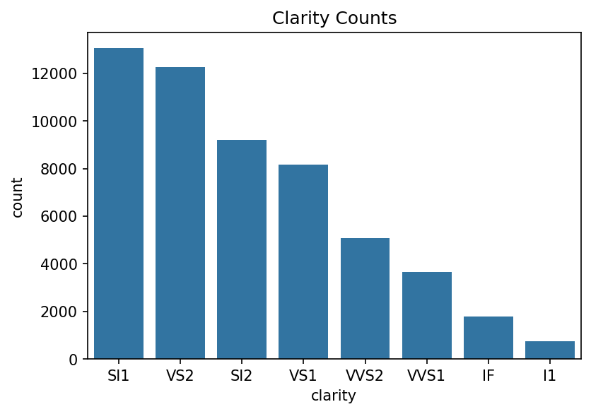

# [Slide 1]
# 다이아몬드 시장 분석 및 비즈니스 인사이트
### Diamonds EDA & Business Strategy Report

**작성일:** 2024. 05. 23
**분석 데이터:** 53,940 Diamonds Dataset

---

# [Slide 2]
# 목차 (Index)

1. 데이터 개요 및 기초 통계
2. 데이터 품질 검사
3. 범주형 데이터 분포
4. 가격(Price) 분석 및 인사이트
5. 품질(Cut/Color) 변수 분석
6. 핵심 변수 간 상관관계
7. 투명도(Clarity) 및 교차 분석
8. 최종 비즈니스 전략 제언

---

# [Slide 3]
# 1. 데이터 개요 (Dataset Overview)

- **전체 행 수:** 53,940개
- **전체 열 수:** 10개
- **주요 컬럼:**
  - **4C:** Carat, Cut, Color, Clarity
  - **Physical:** x, y, z, depth, table
  - **Target:** Price

---

# [Slide 4]
# 2. 기초 기술 통계 (Numeric Summary)

| 통계량 | Carat | Price | X | Y | Z |
|:---:|:---:|:---:|:---:|:---:|:---:|
| **Mean** | 0.797 | $3,932 | 5.73 | 5.73 | 3.53 |
| **Std** | 0.474 | $3,989 | 1.12 | 1.14 | 0.70 |
| **Min** | 0.20 | $326 | 0.00 | 0.00 | 0.00 |
| **Max** | 5.01 | $18,823 | 10.74 | 58.90 | 31.80 |

---

# [Slide 5]
# 3. 데이터 품질 및 결측치 검사

- **결측값:** 전 컬럼 0건 (Clean Data)
- **특이사항 발견:**
  - `x, y, z` 값의 최솟값이 **0**으로 나타남.
  - 이는 실제 다이아몬드에서 불가능한 수치로, 데이터 수집 과정의 오류로 판단됨.
- **조치 권고:** 분석 및 모델링 전 해당 행 제거 또는 보정 필요.

---

# [Slide 6]
# 4. 데이터 왜도(Skewness) 및 첨도(Kurtosis)

- **Skewness:** Price(1.61), Carat(1.11), Y(2.43)가 높은 양의 왜도를 보임. 
  - 특정 고가/대형 제품에 치우친 분포.
- **Kurtosis:** Y(91.2), Z(47.0)가 극단적으로 높음.
  - 데이터의 이상치(Outlier) 존재 가능성이 매우 높음을 시사.

---

# [Slide 7]
# 5. 범주형 분포: Cut (세공)

- **Ideal:** 21,551 (최다)
- **Premium:** 13,791
- **Very Good:** 12,082
- **Good:** 4,906
- **Fair:** 1,610 (최소)

> 시장에는 최상급 세공(Ideal) 제품이 가장 많이 유통되고 있음.

---

# [Slide 8]
# 6. 범주형 분포: Color (색상)

- **G Color:** 11,292 (최다)
- **E, F Color:** 각 9,000대 유지
- **J Color:** 2,808 (최소, 최하위 등급)

> 중간 등급인 G 컬러를 중심으로 대중적인 재고가 형성되어 있음.

---

# [Slide 9]
# 7. 범주형 분포: Clarity (투명도)

- **SI1:** 13,065
- **VS2:** 12,258
- **IF:** 1,790 (최상급, 희소)
- **I1:** 741 (최하급)

> 육안상 결점이 거의 없는 SI1, VS2 등급이 전체 시장의 핵심 상품군임.

---

# [Slide 10]
# 8. [시각화] 가격 분포 (Price Distribution)

---

# [Slide 11]
# 9. [인사이트] 대중적 시장의 가격 심리선

- **데이터 확인:** $2,175 이하 구간에 **25,335개(약 47%)** 집중.
- **비즈니스 해석:**
  - 소비자의 약 절반은 $2,000 내외의 제품을 선호.
  - 저가형 라인업의 회전율 극대화 전략이 필수적.

---

# [Slide 12]
# 10. [시각화] Cut별 가격 분포

---

# [Slide 13]
# 11. [인사이트] 품질 등급의 역설

- **이상 현상:** 세공 등급이 낮은 **Fair 등급의 평균가($4,358)**가 **Ideal($3,457)**보다 높음.
- **원인 분석:** Fair 등급 제품들은 대개 중량(Carat)이 매우 크기 때문에 품질 손해를 감수하고 가격이 높게 측정됨.
- **전략:** "품질보다 크기"를 중시하는 실속형 대형석 시장 존재 확인.

---

# [Slide 14]
# 12. [시각화] 중량 vs 가격 (Clarity 구분)

---

# [Slide 15]
# 13. [인사이트] 1캐럿의 임계점(Threshold)

- **데이터 확인:** 1.0캐럿을 기점으로 Clarity 등급 간 가격 격차가 급격히 벌어짐.
- **비즈니스 해석:**
  - 1캐럿 이상부터는 '투명도'가 자산 가치를 결정하는 핵심 요소.
  - 프리미엄 마케팅 시 1캐럿 이상 상품은 반드시 Clarity 등급을 강조해야 함.

---

# [Slide 16]
# 14. [시각화] Color별 가격 분포

---

# [Slide 17]
# 15. [인사이트] 하위 컬러 등급의 가치

- **데이터 확인:** 최하위 등급인 **J 컬러의 중앙값($4,234)**이 **D 컬러($1,838)**보다 훨씬 높음.
- **비즈니스 해석:**
  - D, E, F 등급은 소형석(예물용) 위주로 구성.
  - I, J 등급은 대형석 위주로 구성되어 평균 단가가 높음.
  - 대형석 판매 시 컬러 등급의 불리함을 중량감으로 상쇄하는 셀링 포인트 필요.

---

# [Slide 18]
# 16. [시각화] 수치형 변수 상관관계

---

# [Slide 19]
# 17. [인사이트] 가격 결정의 핵심 공식

- **핵심 상관성:** Carat(0.92) > X(0.88) > Y(0.86) > Z(0.86)
- **비즈니스 해석:**
  - 다이아몬드 가격은 '무게'와 '물리적 크기'에 의해 90% 이상 결정됨.
  - Depth(깊이)나 Table(넓이)은 가격 직접 결정보다는 세공 품질에 영향을 주는 보조 지표임.

---

# [Slide 20]
# 18. [시각화] Clarity 빈도 및 교차 분석

---

# [Slide 21]
# 19. [인사이트] 재고 최적화 및 수요 매칭

- **교차 분석 결과:** Ideal 컷이면서 SI1~VS2 등급인 제품이 가장 두터운 층을 형성.
- **비즈니스 적용:**
  - **주력 상품(Cash Cow):** Ideal-SI1/VS2 조합.
  - **희소 상품(Premium):** Ideal-IF 조합 (1,212개 한정).
  - 수요가 검증된 주력 상품의 재고 안정성을 확보하여 기회 손실 방지.

---

# [Slide 22]
# 20. 최종 요약 및 전략 제언

1. **데이터 관리:** 치수(x,y,z)가 0인 오류 데이터를 제거하여 시스템 신뢰도 향상.
2. **이원화 마케팅:** 
   - $2,000 미만: 회전율 중심의 대중 마케팅.
   - 1캐럿 이상: Clarity를 강조한 하이엔드 마케팅.
3. **상품 기획:** Fair 등급이라도 캐럿이 크다면 충분한 고가 시장 형성 가능.
4. **재고 운영:** Ideal-SI1/VS2 등급을 표준 재고로 설정하여 운영 효율화.
